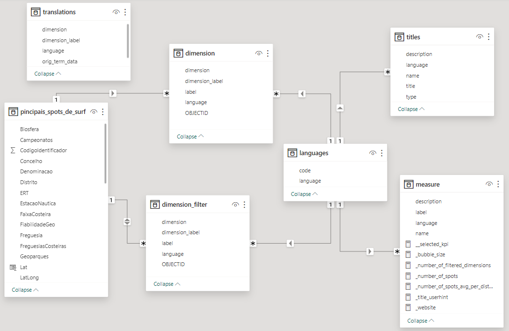
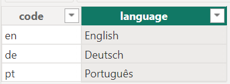
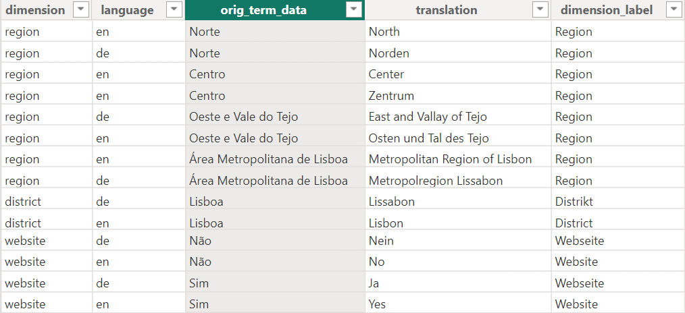

# Data model


## Overview

The data model has seven tables. The tables *titles* and *measures* are already discussed in the chapter *Key concepts*. 
The table *languages* contains a list of the three languages *English* (en), *Deutsch* (de) and *Português* (pt) from which the user
can choose the preferred language. The small arrows along the lines indicate that *titles*, *measure* and *dimension* and *dimension_filter* (including translations)
are filtered to the selected language. 
Further information about relationships you find in the article *Model relationships in Power BI Desktop*.[^sn1]


[^sn1]: [Model relationships in Power BI Desktop (learn.microsoft.com)](https://learn.microsoft.com/en-us/power-bi/transform-model/desktop-relationships-understand)





## Data files

You can find all data files in the *data* directory of the GitHub repository.[^sn2]


[^sn2]: [github.com/t4d-gmbh/powerbi-example-surfspots](https://github.com/t4d-gmbh/powerbi-example-surfspots/tree/main/data)


## Tables

### principais_spots_de_surf

The imported CSV file from dados.gov.pt. 
Since latitude and longitude are stored in one field (separated by a semicolon), they are extracted in two calculated columns.
In addition, we create a calculated column that indicates whether a website is available or not. 
Since the language of the data set is Portuguese, we use Portuguese terms and translate them later on.


    Lat = CONVERT(
        SUBSTITUTE(TRIM(MID([LatLong], 1, FIND(";", [LatLong])-1)), ",", "."), 
        DOUBLE
    )
---
    Long = CONVERT(
        SUBSTITUTE(TRIM(MID([LatLong], FIND(";", [LatLong])+1,10)), ",", "."), 
        DOUBLE
	)
---
    Website_available = IF(
        CONTAINSSTRING('pincipais_spots_de_surf'[Website], "http"), 
        "Sim", 
        "Não"
    )


### languages

This report is available in three languages:




If a new language is added, a translation must also be added for each measure and each title (tables *measure* and *titles*).
If translations are not yet available for each measure or title, use one of the existing languages provisionally.


### dimension

This is calculated table. It unpivots the columns *OBJECTID*, *LimitePROT* (region), *Distrito* and *Website_available* of
the table *principais_spots_de_surf* to the columns *OBJECTID*, *dimension* and *label*. 
For each language in the table *languages* a row per OBJECTID and dimension is created. 
If a translation is available in the table *translations*, it is used for the *label* and the *dimension_label*. 
If no translation is available, the original language from the data is used (Portuguese).


```{note}
These data transformations can also be done in *Microsoft Power Query*[^sn3] which is a separate software. 
As already mentioned, in this tutorial we focus on Power BI Desktop.

The idea of this table is to allow users to select a dimension for a visual (for example, the categories on the y-axis in a bar chart). 
This functionality can also be implemented with *Field parameters*.[^sn4]
See also the note at the end of this page.
```


[^sn3]: [Unpivot columns (Power Query)](https://support.microsoft.com/en-au/office/unpivot-columns-power-query-0f7bad4b-9ea1-49c1-9d95-f588221c7098)


[^sn4]: [Let report readers use field parameters to change visuals (learn.microsoft.com)](https://learn.microsoft.com/en-us/power-bi/create-reports/power-bi-field-parameters)


### dimension_filter

We use the table *dimension* for visualizations.
For filtering data, we create a second table, a copy of *dimension*, which gives us more flexibility when creating the report.


    dimension_filter = ALL('dimension')


### translations

In this table, the original terms from the table *principais_spots_de_surf* (Portuguese) are translated into other languages. 
The translation is optional. If no translation is available for a term, the Portuguese term is used for all other languages (see table *dimension*).





```{note}

The translation of data values can also be achieved with the *Field parameters* feature, which was introduced by Microsoft in 2022. 
A detailed and helpful description can be found in the article *Implement data translation using field parameters*.[^sn5]
 
The approach we use here has the advantage that new languages and translations can be added dynamically 
without changing the structure of the data model.

However, depending on the use case, the use of *Field parameters* may be the better solution. 
In our experience, *Field parameters* offer better performance, which becomes relevant with larger data models (several hundred megabytes).

```

[^sn5]: [Implement data translation using field parameters](https://learn.microsoft.com/en-us/power-bi/guidance/data-translation-implement-field)


