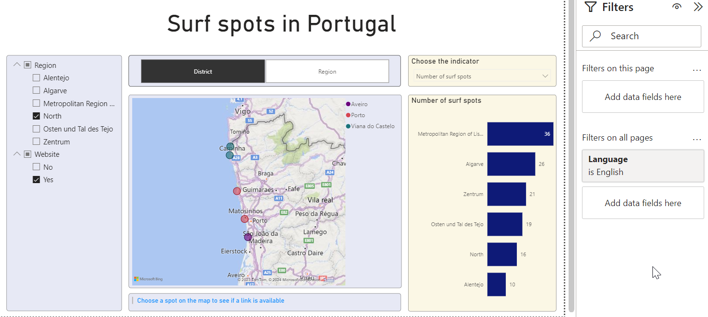

# Introduction


## Idea

In this tutorial, we present a basic structure for a Microsoft Power BI data model and a report. 
As an example, we use a public dataset with 129 surf spots in Portugal.[^sn1]


[^sn1]: [Principais Spots de Surf (dados.gov.pt)](https://dados.gov.pt/pt/datasets/principais-spots-de-surf-3/) 


```{note}
We present some concepts that have proven useful in our practical work. 
However, there are many different ways to implement a certain functionality in Power BI. 
```

## Key features

This Power BI data model and report have the following key features:

 - Dynamic multilingualism of (almost) the entire report
 - User can change the legend of the map
 - User can choose a measure for the bar chart on the right side

 
## The report

In *Filters on all pages* the user can choose the preferred language. 
The selected options in the slice (a filter within the report page on the left side) are combined with an AND operator.




## Microsoft Fabric
In 2023 Microsoft launched the data analytics platform *Microsoft Fabric* and Power BI is a part of it. 
The Power BI Architecture itself consists of several components. A short description of each component you find in the article
*Components of Power BI Architecture*[^sn2].
To keep this tutorial simple, we will focus on the *Power BI Desktop*[^sn3] software, which can be downloaded for free. 


[^sn2]: [Components of Power BI Architecture (medium.com)](https://medium.com/@theknowledgeacademy/components-of-power-bi-architecture-d12dd18acf41)

[^sn3]: [Power BI Desktop](https://powerbi.microsoft.com/en-us/desktop/)


## Disclaimer

This is not a beginner's guide in which all concepts are explained from scratch. There are already plenty of helpful websites for beginners, like the 
official article from microsoft.com *Get started with Power BI Desktop*[^sn4] or the *Power BI Tutorial for Beginners*[^sn5] from datacamp.com.

[^sn4]: [Get started with Power BI Desktop (microsoft.com)](https://learn.microsoft.com/en-us/power-bi/fundamentals/desktop-getting-started)
 
[^sn5]: [Power BI Tutorial for Beginners](https://www.datacamp.com/tutorial/tutorial-power-bi-for-beginners)


 


