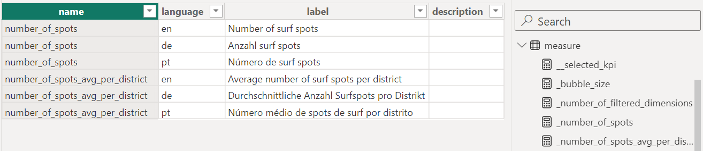
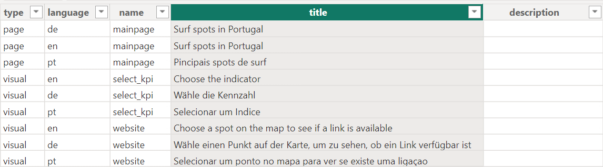
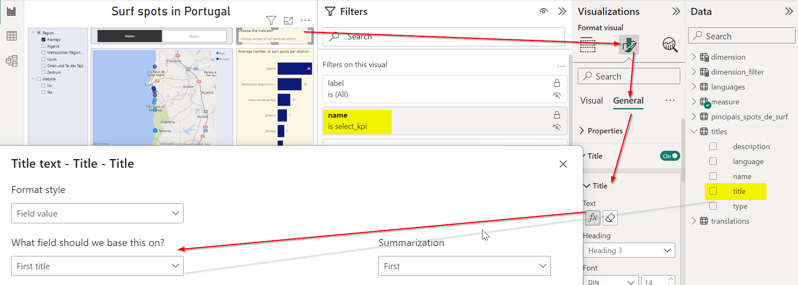

# Key concepts

Here we introduce a few specific key concepts of Power BI. 
To get a better overview see the article *Basic concepts for designers in the Power BI service*[^sn1]


[^sn1]: [Basic concepts for designers in the Power BI service (learn.microsoft.com)](https://learn.microsoft.com/en-us/power-bi/fundamentals/service-basic-concepts)

## Data Analysis Expressions (DAX)

*Data Analysis Expressions*[^sn2] are the programming language of Power BI. They are mainly used to create *measures* and *calculated columns*. 


[^sn2]: [Data Analysis Expressions (learn.microsoft.com)](https://learn.microsoft.com/en-us/dax)


## Visuals

A data visualization like bar, column pie or line charts and many more.[^sn3]
Matrices, tables and slicers (filter options within the report page) are also considered as "visuals".

[^sn3]: [Visualization types in Power BI](https://learn.microsoft.com/en-us/power-bi/visuals/power-bi-visualization-types-for-reports-and-q-and-a)


## Measures

A measure is usually a set of Data Analysis Expressions to calculate a scalar value like a key performance index (KPI). 
A measure is dynamically **recalculated** each time when the filter context changes (for example, if a user changes the filter options).

```{note}
A complicated measure may require a lot of resources (CPU and memory).
The calculation works if the machine on which Power BI Desktop is installed has enough resources. 
However, if the report is published on *Power BI Service*, 
the measure might lead to a **visual has exceeded available resources** error because the resources on *Power BI Service* are limited.[^sn4]
Keep that in mind, when preparing a report for publication.
```


[^sn4]: [Capacities and SKUs](https://learn.microsoft.com/en-us/power-bi/enterprise/service-premium-what-is#capacities-and-skus)


A measure can be added to any table and technically it does not matter to which table it is attached. 
If you create numerous measures, you might lose the overview. 
For this reason, we recommend creating a table (if possible in the data source, independent of Power BI) in which all measures are listed. 
By convention, the value of column *name* should correspond to the name of the measure in Power BI.



Since *measures* is a reserved key word in Power BI, the table was named *measure*. 
The translations must also be provided.
Further columns can be added to provide additional information like description, unit or an URL. 
This table can be used to create structured documentation for the users. 
In Power BI all measures are attached to this table.


Instead of creating a visual for each measure, we can let the user select (in a slicer) a measure for a visual.
For this we create the following additional measure (DAX) and attach it to the table *measure*:


    __selected_kpi = SWITCH(
 
        TRUE(),
	
	
        SELECTEDVALUE('measure'[name]) = "number_of_spots",                  

        [_number_of_spots],
	
	
        SELECTEDVALUE('measure'[name]) = "number_of_spots_avg_per_district", 
	
        [_number_of_spots_avg_per_district],
	
	
        BLANK()
	
    )
	
```{note}
If one visual is used to visualize several measures and these measures have different units (number, price, distance, etc.), 
make sure that each measure leads to a meaningful visualization. 
The unit can be, for example, added in brackets to the label of the measure.
The label of the measure can also be used as a title of the visual to clarify which measure is being displayed.
```


## Calculated columns

A calculated column, like a measure, is a set of Data Analysis Expressions that calculate a scalar value or a text. 
Unlike a measure, a calculated column is permanently assigned to a table and is only recalculated when the entire data set is refreshed. 
Expressions that depend on a specific filter context **cannot** be used in a calculated column. 
It is also possible to calculate an entire table.


## Titles

Instead of using hardcoded titles for report pages and visuals, we recommend saving all titles in a table, 
like we did with the measures. By integrating the table into the data set, we can use the column *title* for report pages and visuals. 
If the report is shared with other users through *Power BI Service* and a title needs to be adjusted, 
the change only needs to be made in the table *titles* and will be available in the report after the next data refresh. 
It is not necessary to change and republish the whole report.




Click on the visual in the report, go to *Format visual* > *General* > *Title* and select the column *title* from the table *titles* (see figure below).
Finally define in *Filters on this visual* which title ( column *name*) to use for the visual.

