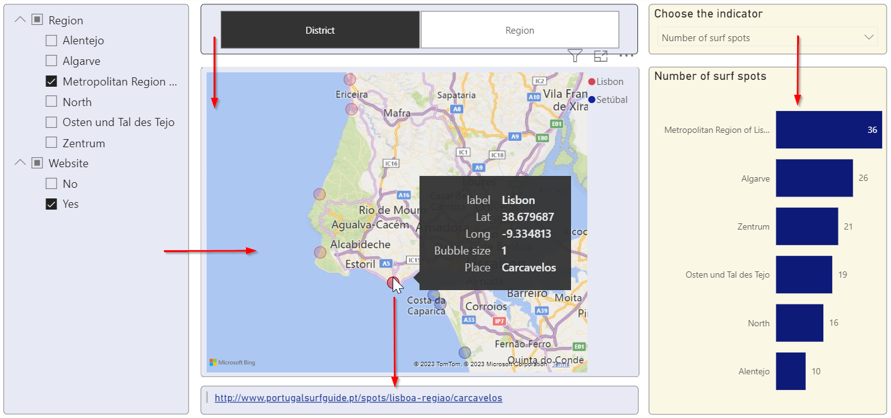

# The report

## Overview

The red arrows indicate how filters are applied within the report.
Further information about this topic you find in the article *Change how visuals interact in a Power BI report*.[^sn1]

[^sn1]: [Change how visuals interact in a Power BI report (learn.microsoft.com)](https://learn.microsoft.com/en-us/power-bi/create-reports/service-reports-visual-interactions?tabs=powerbi-desktop)

## Filtering

By default, multiple filters are combined with an *OR* operator.
The above filter settings would select all surf spots that are either located in the Lisbon metropolitan area *OR* that have a website.
To override this behavior, we created the following measures. 
Only surf spots that are located in one of the selected regions *AND* for which a website is available are displayed on the map.
Otherwise the *Bubble size* is blank and the spot is not displayed.

    _bubble_size = IF(
        NOT ISBLANK(SELECTEDVALUE('dimension'[label])) &&
        COUNT('dimension_filter'[OBJECTID]) == [_number_of_filtered_dimensions], 
        1, 
        BLANK()
    )
	
---

    _number_of_filtered_dimensions = CALCULATE(
        DISTINCTCOUNT('dimension_filter'[dimension]),
        CROSSFILTER(
          'pincipais_spots_de_surf'[OBJECTID],
          'dimension_filter'[OBJECTID], 
          None
        )
    )

## Multilingualism

In *Filters on all pages* the user can choose the preferred language. 
As we can see, not all terms are translated yet, for example, the terms *label*, *Bubble size* and *Place* in the black tooltip box. 
These terms may be translated with the *Translation builder*.[^sn2]

[^sn2]: [Create multiple-language reports with Translations Builder (learn.microsoft.com)](https://learn.microsoft.com/en-us/power-bi/guidance/translation-builder)

